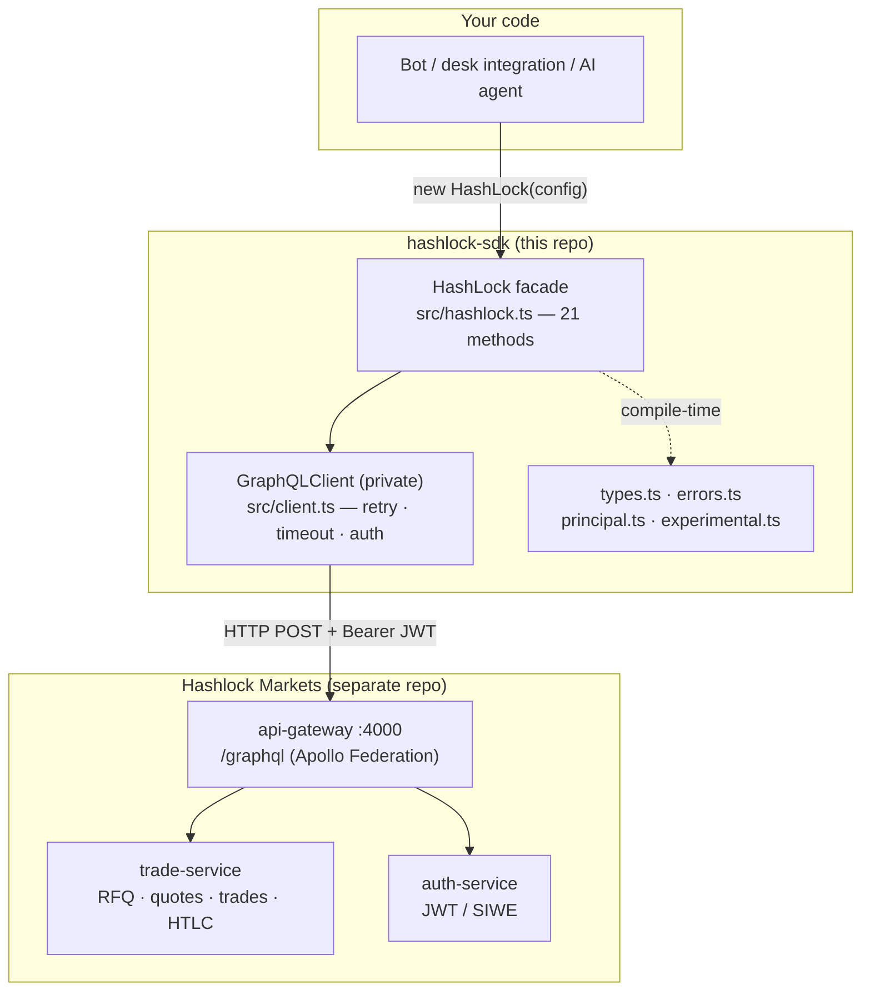
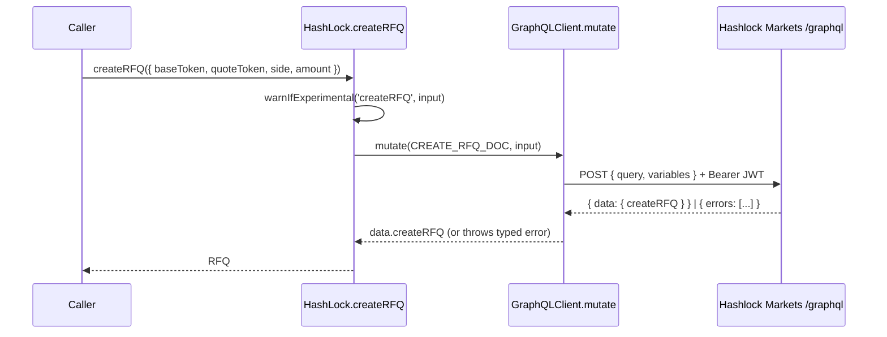
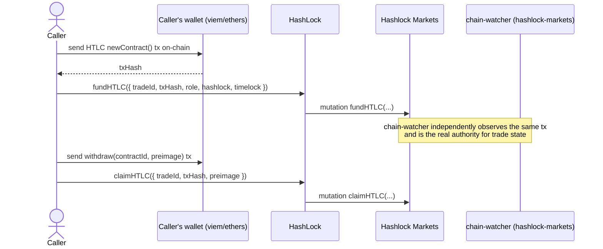

<!-- Language: **English** · [Русский](./ARCHITECTURE.ru.md) -->

# hashlock-sdk — Architecture

> **The authoritative architecture reference for this repository.** It explains what
> every part is, how the parts connect, how a call flows from your code to the Hashlock
> Markets backend and back, and the reasoning behind the design — verified against `main`
> (counts reflect the code as of 2026-05-30).
>
> This is the **TypeScript client SDK** that wraps the Hashlock Markets GraphQL API. For
> the system it talks to, read the master doc:
> [**hashlock-markets / ARCHITECTURE.md**](https://github.com/Hashlock-Tech/hashlock-markets/blob/main/docs/architecture/ARCHITECTURE.md).
>
> Every non-obvious claim points at a `path:line` you can open. If a number here ever
> disagrees with the code, the code wins — please fix the doc.

---

## 1. What it is, and the core idea

`@hashlock-tech/sdk` is a **thin, fully-typed TypeScript client** over the Hashlock Markets
GraphQL surface. It lets a program — a market-maker bot, an institutional desk integration,
an AI agent — drive the **same RFQ → quote → trade → HTLC-settlement** lifecycle that the web
app drives, without hand-writing GraphQL strings or guessing field shapes.

The whole package is one public class, `HashLock` (`src/hashlock.ts:66`), exposing **21
async methods** (`src/hashlock.ts`, one per GraphQL operation) plus `setAccessToken`. Every
method is a typed wrapper that holds an inline GraphQL document and delegates transport to a
private `GraphQLClient` (`src/client.ts:17`).

### Why it is built this way (the load-bearing decisions)

| Decision | Why |
|---|---|
| **Zero runtime dependencies** | `package.json` lists only `devDependencies` (`package.json:35-39`). The SDK uses the platform `globalThis.fetch` (`src/client.ts:29`), so it runs unchanged in Node ≥18, Deno, browsers, and edge runtimes with no dependency tree to audit. |
| **Facade over a hidden transport** | `HashLock` is the only surface consumers touch; `GraphQLClient` is **not exported** (`src/index.ts:1-10`) — retry, timeout, and auth are implementation details that can change without a breaking API. |
| **GraphQL documents inlined per method** | Each method owns its query/mutation string (e.g. `src/hashlock.ts:98-104`). There is no codegen step and no schema dependency, so the SDK ships as plain `.ts` and stays readable. The cost: field lists are maintained by hand and must track the backend SDL. |
| **Mutations never retried on 5xx** | `mutate()` passes `retryOn5xx = false` (`src/client.ts:56-61`) because trade/HTLC mutations are **not idempotent** — a retried `fundHTLC` could double-record. Only `query()` retries server errors (`src/client.ts:45-50`). |
| **Typed error hierarchy** | Callers branch on `AuthError` / `GraphQLError` / `NetworkError` (`src/errors.ts`) instead of parsing strings, so token-refresh vs. retry vs. surface-to-user logic is unambiguous. |
| **Experimental fields warn, never silently drop** | Agent-layer fields are accepted at the type surface but not yet wired to the backend; the SDK emits a one-time `console.warn` (`src/experimental.ts:49`) rather than letting a caller assume the field reached the server. |

---

## 2. System at a glance

**Reading it:** your code constructs one `HashLock` (`src/hashlock.ts:69`) with an endpoint
and a JWT. Every method call becomes an HTTP `POST` to the backend's **`/graphql`** entry
with an `Authorization: Bearer <token>` header (`src/client.ts:80-89`). The SDK holds **no
chain logic, no keys, and no on-chain state** — it records on-chain actions the caller has
already taken (e.g. `fundHTLC` records a tx hash you broadcast yourself) and reads
backend-derived state back. The settlement authority lives entirely in hashlock-markets
(see [master doc §4.1, chain-watcher](https://github.com/Hashlock-Tech/hashlock-markets/blob/main/docs/architecture/ARCHITECTURE.md#41-backend-services)).

---

## 3. Package layout

`git ls-files` is 20 files; the seven that *are* the SDK live in `src/`:

| File | Role |
|---|---|
| `src/index.ts` | Public barrel — exports `HashLock`, `MAINNET_ENDPOINT`, the error classes, all types, and the KYC helpers (`src/index.ts:1-11`). The **only** module a consumer imports. |
| `src/hashlock.ts` | The `HashLock` facade class — 21 GraphQL-backed methods grouped RFQ / quotes / trades / HTLC-EVM / HTLC-Bitcoin (`src/hashlock.ts:66`). |
| `src/client.ts` | `GraphQLClient` — private low-level transport: retry with exponential backoff, timeout via `AbortController`, error normalization (`src/client.ts:17`). Not exported. |
| `src/errors.ts` | Error hierarchy: `HashLockError` base + `GraphQLError`, `NetworkError`, `AuthError` (`src/errors.ts:4,18,31,41`). |
| `src/types.ts` | All domain objects, enums, and mutation input/result interfaces — a hand-maintained mirror of the backend GraphQL SDL (`src/types.ts`). |
| `src/principal.ts` | **Experimental** KYC-tier + principal-attestation types and the `meetsKycTier` helper (`src/principal.ts:62`). |
| `src/experimental.ts` | The one-time experimental-field warning machinery (`src/experimental.ts:49`). |

Build & test scaffolding: `tsup.config.ts` (ESM+CJS dual build, `.d.ts`, `target: es2022` —
`tsup.config.ts:5-11`), `vitest.config.ts`, `src/__tests__/hashlock.test.ts`,
`.github/workflows/ci.yml`.

---

## 4. The layered architecture

Three layers, strictly one-directional: **facade → transport → (types/errors)**.

### 4.1 The facade (`HashLock`)
A method-per-operation class. Each method (a) optionally warns on experimental fields, (b)
calls `client.query` or `client.mutate` with an inline GraphQL document and the typed input,
(c) returns the typed payload. Example — `createRFQ` (`src/hashlock.ts:96-106`):

The method groups (`src/hashlock.ts`):

| Group | Methods | Lines |
|---|---|---|
| RFQ | `createRFQ`, `getRFQ`, `listRFQs`, `cancelRFQ` | `:96,111,126,141` |
| Quotes | `submitQuote`, `acceptQuote`, `getQuotes` | `:166,181,195` |
| Trades | `getTrade`, `listTrades`, `confirmDirectTrade`, `acceptTrade`, `cancelTrade`, `confirmSettlementWallets` | `:212,226,241,255,267,279` |
| HTLC — EVM | `fundHTLC`, `claimHTLC`, `refundHTLC`, `getHTLCStatus`, `getHTLCs` | `:308,332,354,368,384` |
| HTLC — Bitcoin | `prepareBitcoinHTLC`, `buildBitcoinClaimPSBT`, `broadcastBitcoinTx` | `:414,429,443` |

### 4.2 The transport (`GraphQLClient`)
The private engine that every method funnels through (`src/client.ts:63-149`). Its
responsibilities:

- **Auth** — sets `Authorization: Bearer <accessToken>` when a token is present
  (`src/client.ts:80-82`); `setAccessToken` swaps it live (`src/client.ts:36`).
- **Timeout** — an `AbortController` aborts after `timeout` ms (default `30_000`,
  `src/client.ts:4,72-73`).
- **Retry policy** — up to `retries` attempts (default `3`, `src/client.ts:5`) with
  exponential backoff `1000 × 2^attempt` ms (`src/client.ts:151-154`). Retries fire on
  network/timeout errors always, and on **5xx only for queries** (`src/client.ts:99-107`).
- **Error mapping** — `401/403` → `AuthError` (never retried, `src/client.ts:94-96`); GraphQL
  `errors[]` → `GraphQLError` (`src/client.ts:112-117`); empty `data` → `GraphQLError`
  (`src/client.ts:119-121`); everything else → `NetworkError` (`src/client.ts:141-144`).

### 4.3 Errors & types
`errors.ts` gives every failure a `code` and a class so callers branch cleanly
(`README.md:207-223`). `types.ts` is the compile-time contract: enums (`Side`, `RFQStatus`,
`QuoteStatus`, `HTLCRole`, `TradeStatus`, `HTLCStatus` — `src/types.ts:9-45`), domain objects
(`RFQ`, `Quote`, `Trade`, `HTLC` — `src/types.ts:49-125`), and input/result interfaces. These
types are a **hand-maintained projection** of the backend SDL, not generated from it — the
trade-off chosen with the "GraphQL inlined per method" decision in §1.

---

## 5. End-to-end flows

### 5.1 RFQ → quote → accept → trade
The SDK mirrors the backend lifecycle (see
[master doc §5.1](https://github.com/Hashlock-Tech/hashlock-markets/blob/main/docs/architecture/ARCHITECTURE.md#51-rfq--quote--accept--trade)).
A taker calls `createRFQ` (`src/hashlock.ts:96`); makers `submitQuote` (`:166`); the taker
`acceptQuote` (`:181`), whose payload carries the newborn `trade { id status }`
(`src/hashlock.ts:185`). A direct OTC path skips RFQ: `confirmDirectTrade` (`:241`).

### 5.2 HTLC settlement (the SDK *records*, it does not *sign*)
This is the most important boundary to internalize: **the SDK never holds keys or builds
signed on-chain transactions for EVM**. The caller broadcasts the lock/claim/refund tx with
their own wallet (ethers/viem), then tells the backend about it:

`fundHTLC` (`src/hashlock.ts:308`), `claimHTLC` (`:332`), `refundHTLC` (`:354`),
`getHTLCStatus` (`:368`). The backend's chain-watcher is the sole on-chain authority — the
SDK's `fundHTLC` is a hint/record, **not** what advances the trade
([master doc §5.2 / §5.6](https://github.com/Hashlock-Tech/hashlock-markets/blob/main/docs/architecture/ARCHITECTURE.md#52-htlc-settlement-on-one-evm-chain)).

### 5.3 Bitcoin & cross-chain
Bitcoin HTLCs need no deployed contract — `prepareBitcoinHTLC` (`src/hashlock.ts:414`) asks
the backend for a **P2WSH address + redeem script** (`BitcoinHTLCPrepareResult`,
`src/types.ts:254-266`); the caller funds it, then `buildBitcoinClaimPSBT` (`:429`) returns an
**unsigned PSBT** the caller signs with Xverse/Leather/UniSat, and `broadcastBitcoinTx` (`:443`)
relays the signed hex. A cross-chain ETH↔BTC swap composes these — both legs share one
SHA-256 hashlock so one preimage unlocks both (`README.md:181-205`,
[master doc §5.3](https://github.com/Hashlock-Tech/hashlock-markets/blob/main/docs/architecture/ARCHITECTURE.md#53-cross-chain-atomic-swap--preimage-relay)).
Cross-chain RFQs additionally set `baseChain` / `quoteChain` (`src/types.ts:144-175`), which
the backend resolves against its `ChainRegistry` (the allowed ids are enumerated in
`RFQChainId`, `src/types.ts:136-142`).

### 5.4 Authentication
The SDK is a **bearer-token consumer, not an auth provider** — it does not perform SIWE. The
caller obtains a JWT (web login or the SIWE flow in auth-service) and passes it as
`accessToken` (`src/types.ts:326-337`); `setAccessToken` refreshes it after rotation
(`src/hashlock.ts:74`). A `401/403` surfaces as `AuthError` so the caller can refresh and
retry (`src/client.ts:94-96`,
[master doc §5.5](https://github.com/Hashlock-Tech/hashlock-markets/blob/main/docs/architecture/ARCHITECTURE.md#55-authentication--human-siwe-and-agent-otk)).

---

## 6. The experimental agent / attestation layer

A forward-looking type surface for the **agent economy**: an order can carry a
`PrincipalAttestation` (an opaque binding to a KYC'd entity — `principalId`, `principalType`,
`tier`, rotating `blindId`, `proof`, validity window; `src/principal.ts:26-41`) and an
`AgentInstance` (`src/principal.ts:43-52`), with a `KycTier` lattice
`NONE < BASIC < STANDARD < ENHANCED < INSTITUTIONAL` (`src/principal.ts:17-22`) and the
`meetsKycTier` comparator (`src/principal.ts:62-64`).

> **Honest status flag (not invented — stated in the code):** these agent-layer input
> fields (`attestation`, `agentInstance`, `minCounterpartyTier`, `hideIdentity` on
> `CreateRFQInput` / `SubmitQuoteInput` / `FundHTLCInput`) are **accepted at the type surface
> but NOT yet sent to the backend** — a no-op at the network layer until the Cayman GraphQL
> schema accepts `PrincipalAttestationInput` (`src/principal.ts:10-15`, `src/types.ts:163-175`).
> To prevent silent confusion, `warnIfExperimental` (`src/experimental.ts:49-65`) emits a
> one-time `console.warn` per `method.field` the first time one is set; suppress with
> `HASHLOCK_SDK_SILENCE_EXPERIMENTAL=1` (`src/experimental.ts:15-19`). The `principal.ts`
> shapes are a deliberate **duplicate** of `@hashlock-tech/intent-schema` kept in sync by hand
> so the SDK has no runtime dependency (`src/principal.ts:1-9`).

---

## 7. Build, test & CI

- **Build** — `tsup` emits ESM (`dist/index.js`) + CJS (`dist/index.cjs`) + `.d.ts` for both,
  `target: es2022`, sourcemaps on (`tsup.config.ts`, `package.json:6-21`).
- **Lint** — `pnpm lint` is `tsc --noEmit` (`package.json:32`); there is no ESLint step.
- **Test** — `vitest run` over `src/__tests__/hashlock.test.ts` (~30 cases): per-method
  happy paths with a mocked `fetch`, the error-mapping matrix (`GraphQLError`/`AuthError`/
  `NetworkError`), header injection, cross-chain variable forwarding
  (`hashlock.test.ts:40-61`), and the experimental-warning behaviour (`:387-456`).
- **CI** — `.github/workflows/ci.yml` runs lint → test → build on Node **18, 20, 22**
  (`ci.yml:13-29`) for every push/PR to `main`.

---

## 8. How this repo connects to hashlock-markets

This SDK is one of the sibling repos catalogued in the master doc's
[§3 "repositories and how they connect"](https://github.com/Hashlock-Tech/hashlock-markets/blob/main/docs/architecture/ARCHITECTURE.md#3-the-repositories-and-how-they-connect)
— its row reads *"hashlock-sdk → TypeScript SDK over the GraphQL/MCP surface."* Concretely:

| Connection | Detail |
|---|---|
| **Entry point** | `MAINNET_ENDPOINT = 'https://hashlock.markets/graphql'` (`src/hashlock.ts:44`) targets the **api-gateway** `/graphql` — the Apollo Federation gateway ([master doc §2/§4.1](https://github.com/Hashlock-Tech/hashlock-markets/blob/main/docs/architecture/ARCHITECTURE.md#2-system-at-a-glance)). It deliberately **does not** use `/api/graphql` (the web app's SSR proxy that reads the httpOnly cookie and would reject SDK Bearer auth — `src/hashlock.ts:30-43`). |
| **Operation mapping** | Each SDK method names a real trade-service resolver: `createRFQ`/`submitQuote`/`acceptQuote` → [master §5.1](https://github.com/Hashlock-Tech/hashlock-markets/blob/main/docs/architecture/ARCHITECTURE.md#51-rfq--quote--accept--trade); `fundHTLC`/`claimHTLC`/`refundHTLC` → [§5.2](https://github.com/Hashlock-Tech/hashlock-markets/blob/main/docs/architecture/ARCHITECTURE.md#52-htlc-settlement-on-one-evm-chain). |
| **Auth model** | Consumes the JWT minted by auth-service's login/SIWE flow ([master §5.5](https://github.com/Hashlock-Tech/hashlock-markets/blob/main/docs/architecture/ARCHITECTURE.md#55-authentication--human-siwe-and-agent-otk)). |
| **Settlement authority** | The SDK **records** on-chain actions; hashlock-markets' **chain-watcher** is the sole authority that advances trade state ([master §5.6](https://github.com/Hashlock-Tech/hashlock-markets/blob/main/docs/architecture/ARCHITECTURE.md#56-event-sourcing--chain-watcher-reconciliation-the-spine)). |
| **Mainnet contracts** | The Ethereum HTLC addresses in `README.md:244-250` match the deployments in [master §7](https://github.com/Hashlock-Tech/hashlock-markets/blob/main/docs/architecture/ARCHITECTURE.md#7-the-chain-layer). |
| **Agent economy** | The experimental principal/attestation layer (§6) mirrors `@hashlock-tech/intent-schema` and anticipates the MCP/agent surface ([master §8](https://github.com/Hashlock-Tech/hashlock-markets/blob/main/docs/architecture/ARCHITECTURE.md#8-the-agent--mcp-surface)). |

> **Known doc drift (flagged, not fixed here):** the canonical endpoint is the exported
> `MAINNET_ENDPOINT` (`src/hashlock.ts:44`). Several *prose examples* still show the
> superseded DigitalOcean IP `http://142.93.106.129/graphql` (`README.md:23,44,229`,
> `.env.example:2`) — the code comment marks that host as compromised on 2026-04-22 and "never
> restore" (`src/hashlock.ts:40-42`). Treat `MAINNET_ENDPOINT` as truth. Likewise the package
> is `@hashlock-tech/sdk` (`package.json:2`) though some README snippets still import
> `@hashlock/sdk`. `CHANGELOG.md` tops out at `0.1.4` while `package.json` is `0.2.0`
> (`package.json:3`) — the `0.2.0` cross-chain entry is not yet written up. These are
> documentation lags, not code defects; correcting them is out of scope for this
> architecture PR.

---

## 9. Glossary & where to read next

| Term | Meaning |
|---|---|
| **Facade** | the single `HashLock` class consumers use; hides the transport |
| **HTLC** | Hash-Time-Locked Contract — lock vs a hash; claim reveals the preimage; refund after a timelock |
| **PSBT** | Partially Signed Bitcoin Transaction — the unsigned tx the SDK returns for the caller to sign |
| **Preimage** | the 32-byte secret; `sha256(preimage) = hashlock` on every chain |
| **RFQ** | Request-For-Quote — the sealed-bid quote workflow |
| **SIWE** | Sign-In-With-Ethereum (EIP-4361) — how the JWT this SDK consumes is minted (done outside the SDK) |
| **Principal attestation** | experimental opaque binding of an order to a KYC'd entity, without leaking identity |

**Read next:**
- The facade — `src/hashlock.ts` (start at `createRFQ`, `:96`).
- The transport & retry/error semantics — `src/client.ts`.
- The full system this SDK talks to — [**hashlock-markets / ARCHITECTURE.md**](https://github.com/Hashlock-Tech/hashlock-markets/blob/main/docs/architecture/ARCHITECTURE.md).

---

*For the Russian version see [`ARCHITECTURE.ru.md`](./ARCHITECTURE.ru.md).*
