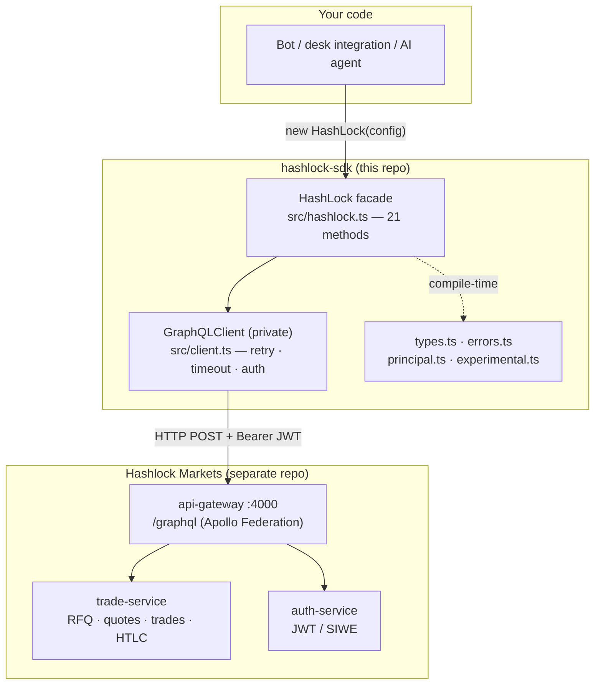
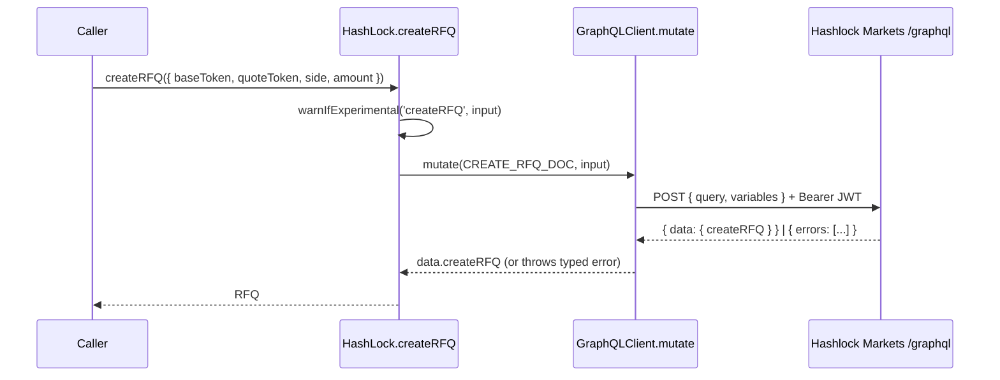
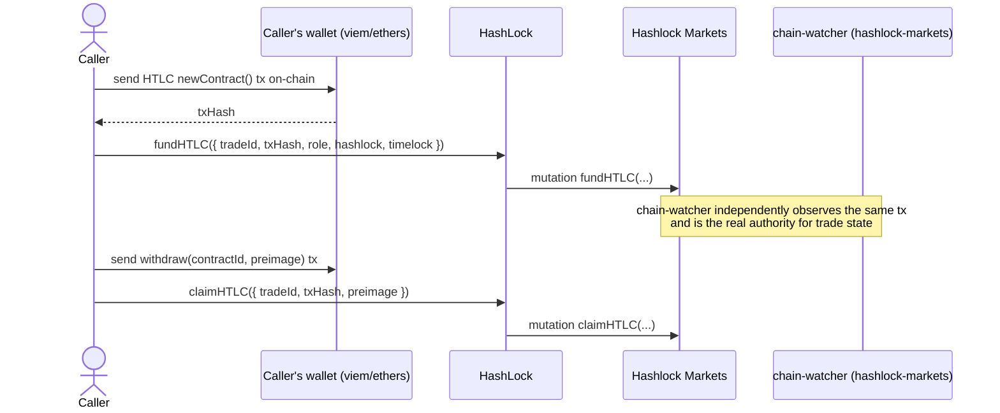

<!-- Язык: [English](./ARCHITECTURE.md) · **Русский** -->

# hashlock-sdk — Архитектура

> **Авторитетный архитектурный справочник по этому репозиторию.** Документ объясняет, что
> представляет собой каждая часть, как части связаны, как вызов проходит от вашего кода к
> бэкенду Hashlock Markets и обратно, и какая логика стоит за архитектурой — всё выверено по
> ветке `main` (числа соответствуют коду на 2026-05-30).
>
> Это **клиентский TypeScript-SDK**, оборачивающий GraphQL API Hashlock Markets. Про систему,
> с которой он общается, читайте мастер-документ:
> [**hashlock-markets / ARCHITECTURE.md**](https://github.com/Hashlock-Tech/hashlock-markets/blob/main/docs/architecture/ARCHITECTURE.md).
>
> Каждое неочевидное утверждение указывает на `path:line`, который можно открыть. Если число
> здесь когда-либо разойдётся с кодом — прав код, исправьте документ.

---

## 1. Что это такое и центральная идея

`@hashlock-tech/sdk` — это **тонкий, полностью типизированный TypeScript-клиент** поверх
GraphQL-поверхности Hashlock Markets. Он позволяет программе — маркет-мейкер-боту, интеграции
институционального деска, ИИ-агенту — управлять **тем же жизненным циклом RFQ → котировка →
сделка → HTLC-сеттлмент**, который ведёт веб-приложение, не выписывая GraphQL-строки руками и
не угадывая формы полей.

Весь пакет — это один публичный класс `HashLock` (`src/hashlock.ts:66`), предоставляющий **21
async-метод** (`src/hashlock.ts`, по одному на GraphQL-операцию) плюс `setAccessToken`. Каждый
метод — это типизированная обёртка, которая держит встроенный GraphQL-документ и делегирует
транспорт приватному `GraphQLClient` (`src/client.ts:17`).

### Почему сделано именно так (несущие решения)

| Решение | Зачем |
|---|---|
| **Ноль рантайм-зависимостей** | В `package.json` есть только `devDependencies` (`package.json:35-39`). SDK использует платформенный `globalThis.fetch` (`src/client.ts:29`), поэтому работает без изменений в Node ≥18, Deno, браузерах и edge-рантаймах — нет дерева зависимостей для аудита. |
| **Фасад над скрытым транспортом** | `HashLock` — единственная поверхность, к которой прикасается потребитель; `GraphQLClient` **не экспортируется** (`src/index.ts:1-10`) — retry, timeout и auth являются деталями реализации, которые можно менять без ломки API. |
| **GraphQL-документы встроены в каждый метод** | Каждый метод владеет своей query/mutation-строкой (например, `src/hashlock.ts:98-104`). Нет шага codegen и нет зависимости от схемы, поэтому SDK поставляется как обычный `.ts` и остаётся читаемым. Цена: списки полей поддерживаются вручную и должны следовать за SDL бэкенда. |
| **Мутации никогда не ретраятся на 5xx** | `mutate()` передаёт `retryOn5xx = false` (`src/client.ts:56-61`), потому что мутации trade/HTLC **не идемпотентны** — повторный `fundHTLC` мог бы записать дважды. Серверные ошибки ретраит только `query()` (`src/client.ts:45-50`). |
| **Типизированная иерархия ошибок** | Вызывающий код ветвится по `AuthError` / `GraphQLError` / `NetworkError` (`src/errors.ts`), а не парсит строки, поэтому логика «обновить токен / повторить / показать пользователю» однозначна. |
| **Экспериментальные поля предупреждают, а не молча отбрасываются** | Поля агентного слоя принимаются на уровне типов, но пока не передаются на бэкенд; SDK выдаёт одноразовый `console.warn` (`src/experimental.ts:49`), а не позволяет вызывающему думать, что поле дошло до сервера. |

---

## 2. Система с высоты птичьего полёта

**Как читать:** ваш код создаёт один `HashLock` (`src/hashlock.ts:69`) с эндпоинтом и JWT.
Каждый вызов метода превращается в HTTP `POST` на **`/graphql`** бэкенда с заголовком
`Authorization: Bearer <token>` (`src/client.ts:80-89`). SDK не держит **никакой чейн-логики,
никаких ключей и никакого он-чейн состояния** — он лишь регистрирует уже совершённые
вызывающим он-чейн действия (например, `fundHTLC` записывает tx-хеш, который вы сами
отправили) и читает обратно состояние, выведенное бэкендом. Авторитет сеттлмента целиком
живёт в hashlock-markets (см. [мастер-документ §4.1, chain-watcher](https://github.com/Hashlock-Tech/hashlock-markets/blob/main/docs/architecture/ARCHITECTURE.md#41-backend-services)).

---

## 3. Структура пакета

`git ls-files` — это 20 файлов; семь, которые *и есть* SDK, живут в `src/`:

| Файл | Роль |
|---|---|
| `src/index.ts` | Публичный barrel — экспортирует `HashLock`, `MAINNET_ENDPOINT`, классы ошибок, все типы и KYC-хелперы (`src/index.ts:1-11`). **Единственный** модуль, который импортирует потребитель. |
| `src/hashlock.ts` | Класс-фасад `HashLock` — 21 метод поверх GraphQL, сгруппированные RFQ / котировки / сделки / HTLC-EVM / HTLC-Bitcoin (`src/hashlock.ts:66`). |
| `src/client.ts` | `GraphQLClient` — приватный низкоуровневый транспорт: retry с экспоненциальной задержкой, timeout через `AbortController`, нормализация ошибок (`src/client.ts:17`). Не экспортируется. |
| `src/errors.ts` | Иерархия ошибок: база `HashLockError` + `GraphQLError`, `NetworkError`, `AuthError` (`src/errors.ts:4,18,31,41`). |
| `src/types.ts` | Все доменные объекты, перечисления и интерфейсы input/result мутаций — поддерживаемое вручную зеркало GraphQL-SDL бэкенда (`src/types.ts`). |
| `src/principal.ts` | **Экспериментальные** типы KYC-тиров + principal-аттестаций и хелпер `meetsKycTier` (`src/principal.ts:62`). |
| `src/experimental.ts` | Механика одноразового предупреждения об экспериментальных полях (`src/experimental.ts:49`). |

Сборка и тесты: `tsup.config.ts` (двойная сборка ESM+CJS, `.d.ts`, `target: es2022` —
`tsup.config.ts:5-11`), `vitest.config.ts`, `src/__tests__/hashlock.test.ts`,
`.github/workflows/ci.yml`.

---

## 4. Слоистая архитектура

Три слоя, строго однонаправленно: **фасад → транспорт → (типы/ошибки)**.

### 4.1 Фасад (`HashLock`)
Класс «метод на операцию». Каждый метод (a) опционально предупреждает об экспериментальных
полях, (b) вызывает `client.query` или `client.mutate` со встроенным GraphQL-документом и
типизированным входом, (c) возвращает типизированный payload. Пример — `createRFQ`
(`src/hashlock.ts:96-106`):

Группы методов (`src/hashlock.ts`):

| Группа | Методы | Строки |
|---|---|---|
| RFQ | `createRFQ`, `getRFQ`, `listRFQs`, `cancelRFQ` | `:96,111,126,141` |
| Котировки | `submitQuote`, `acceptQuote`, `getQuotes` | `:166,181,195` |
| Сделки | `getTrade`, `listTrades`, `confirmDirectTrade`, `acceptTrade`, `cancelTrade`, `confirmSettlementWallets` | `:212,226,241,255,267,279` |
| HTLC — EVM | `fundHTLC`, `claimHTLC`, `refundHTLC`, `getHTLCStatus`, `getHTLCs` | `:308,332,354,368,384` |
| HTLC — Bitcoin | `prepareBitcoinHTLC`, `buildBitcoinClaimPSBT`, `broadcastBitcoinTx` | `:414,429,443` |

### 4.2 Транспорт (`GraphQLClient`)
Приватный движок, через который проходит каждый метод (`src/client.ts:63-149`). Его
обязанности:

- **Auth** — устанавливает `Authorization: Bearer <accessToken>` при наличии токена
  (`src/client.ts:80-82`); `setAccessToken` меняет его на лету (`src/client.ts:36`).
- **Timeout** — `AbortController` прерывает запрос через `timeout` мс (по умолчанию `30_000`,
  `src/client.ts:4,72-73`).
- **Политика retry** — до `retries` попыток (по умолчанию `3`, `src/client.ts:5`) с
  экспоненциальной задержкой `1000 × 2^attempt` мс (`src/client.ts:151-154`). Retry срабатывает
  на сетевые/таймаут-ошибки всегда, а на **5xx — только для запросов** (`src/client.ts:99-107`).
- **Отображение ошибок** — `401/403` → `AuthError` (никогда не ретраится, `src/client.ts:94-96`);
  GraphQL `errors[]` → `GraphQLError` (`src/client.ts:112-117`); пустой `data` → `GraphQLError`
  (`src/client.ts:119-121`); всё прочее → `NetworkError` (`src/client.ts:141-144`).

### 4.3 Ошибки и типы
`errors.ts` даёт каждому сбою `code` и класс, чтобы вызывающий код ветвился чисто
(`README.md:207-223`). `types.ts` — это контракт уровня компиляции: перечисления (`Side`,
`RFQStatus`, `QuoteStatus`, `HTLCRole`, `TradeStatus`, `HTLCStatus` — `src/types.ts:9-45`),
доменные объекты (`RFQ`, `Quote`, `Trade`, `HTLC` — `src/types.ts:49-125`) и интерфейсы
input/result. Эти типы — **поддерживаемая вручную проекция** SDL бэкенда, а не сгенерированы из
него — компромисс, выбранный вместе с решением «GraphQL встроен в каждый метод» из §1.

---

## 5. Сквозные потоки данных

### 5.1 RFQ → котировка → принятие → сделка
SDK зеркалит жизненный цикл бэкенда (см.
[мастер-документ §5.1](https://github.com/Hashlock-Tech/hashlock-markets/blob/main/docs/architecture/ARCHITECTURE.md#51-rfq--quote--accept--trade)).
Тейкер вызывает `createRFQ` (`src/hashlock.ts:96`); мейкеры — `submitQuote` (`:166`); тейкер —
`acceptQuote` (`:181`), чей payload несёт только что рождённую сделку `trade { id status }`
(`src/hashlock.ts:185`). Прямой OTC-путь минует RFQ: `confirmDirectTrade` (`:241`).

### 5.2 HTLC-сеттлмент (SDK *регистрирует*, но не *подписывает*)
Это важнейшая граница для усвоения: **SDK никогда не держит ключи и не строит подписанные
он-чейн транзакции для EVM**. Вызывающий отправляет транзакцию lock/claim/refund своим
кошельком (ethers/viem), а затем сообщает об этом бэкенду:

`fundHTLC` (`src/hashlock.ts:308`), `claimHTLC` (`:332`), `refundHTLC` (`:354`),
`getHTLCStatus` (`:368`). chain-watcher бэкенда — единственный авторитет по он-чейн состоянию;
`fundHTLC` в SDK — это подсказка/запись, **а не** то, что двигает сделку
([мастер-документ §5.2 / §5.6](https://github.com/Hashlock-Tech/hashlock-markets/blob/main/docs/architecture/ARCHITECTURE.md#52-htlc-settlement-on-one-evm-chain)).

### 5.3 Bitcoin и кросс-чейн
Bitcoin-HTLC не требуют задеплоенного контракта — `prepareBitcoinHTLC` (`src/hashlock.ts:414`)
запрашивает у бэкенда **P2WSH-адрес + redeem-скрипт** (`BitcoinHTLCPrepareResult`,
`src/types.ts:254-266`); вызывающий фондирует его, затем `buildBitcoinClaimPSBT` (`:429`)
возвращает **неподписанный PSBT**, который вызывающий подписывает в Xverse/Leather/UniSat, а
`broadcastBitcoinTx` (`:443`) ретранслирует подписанный hex. Кросс-чейн своп ETH↔BTC
комбинирует эти вызовы — обе ноги делят один SHA-256 hashlock, поэтому один прообраз
разблокирует обе (`README.md:181-205`,
[мастер-документ §5.3](https://github.com/Hashlock-Tech/hashlock-markets/blob/main/docs/architecture/ARCHITECTURE.md#53-cross-chain-atomic-swap--preimage-relay)).
Кросс-чейн RFQ дополнительно задают `baseChain` / `quoteChain` (`src/types.ts:144-175`),
которые бэкенд резолвит по своему `ChainRegistry` (разрешённые id перечислены в `RFQChainId`,
`src/types.ts:136-142`).

### 5.4 Аутентификация
SDK — это **потребитель bearer-токена, а не провайдер auth** — он не выполняет SIWE.
Вызывающий получает JWT (вход через веб или SIWE-поток в auth-service) и передаёт его как
`accessToken` (`src/types.ts:326-337`); `setAccessToken` обновляет его после ротации
(`src/hashlock.ts:74`). `401/403` всплывает как `AuthError`, чтобы вызывающий мог обновить
токен и повторить (`src/client.ts:94-96`,
[мастер-документ §5.5](https://github.com/Hashlock-Tech/hashlock-markets/blob/main/docs/architecture/ARCHITECTURE.md#55-authentication--human-siwe-and-agent-otk)).

---

## 6. Экспериментальный слой агента / аттестации

Заглядывающая вперёд поверхность типов для **экономики агентов**: ордер может нести
`PrincipalAttestation` (непрозрачную привязку к KYC'd-сущности — `principalId`, `principalType`,
`tier`, ротируемый `blindId`, `proof`, окно валидности; `src/principal.ts:26-41`) и
`AgentInstance` (`src/principal.ts:43-52`), с решёткой `KycTier`
`NONE < BASIC < STANDARD < ENHANCED < INSTITUTIONAL` (`src/principal.ts:17-22`) и компаратором
`meetsKycTier` (`src/principal.ts:62-64`).

> **Честный флаг статуса (не выдуман — заявлен в коде):** эти входные поля агентного слоя
> (`attestation`, `agentInstance`, `minCounterpartyTier`, `hideIdentity` на `CreateRFQInput` /
> `SubmitQuoteInput` / `FundHTLCInput`) **принимаются на уровне типов, но пока НЕ отправляются
> на бэкенд** — no-op на сетевом уровне, пока GraphQL-схема Cayman не примет
> `PrincipalAttestationInput` (`src/principal.ts:10-15`, `src/types.ts:163-175`). Чтобы избежать
> молчаливой путаницы, `warnIfExperimental` (`src/experimental.ts:49-65`) выдаёт одноразовый
> `console.warn` на каждое `method.field` при первой установке; подавляется через
> `HASHLOCK_SDK_SILENCE_EXPERIMENTAL=1` (`src/experimental.ts:15-19`). Формы из `principal.ts`
> — намеренный **дубликат** `@hashlock-tech/intent-schema`, синхронизируемый вручную, чтобы у
> SDK не было рантайм-зависимости (`src/principal.ts:1-9`).

---

## 7. Сборка, тесты и CI

- **Сборка** — `tsup` выдаёт ESM (`dist/index.js`) + CJS (`dist/index.cjs`) + `.d.ts` для
  обоих, `target: es2022`, sourcemaps включены (`tsup.config.ts`, `package.json:6-21`).
- **Линт** — `pnpm lint` — это `tsc --noEmit` (`package.json:32`); шага ESLint нет.
- **Тесты** — `vitest run` по `src/__tests__/hashlock.test.ts` (~30 кейсов): happy-path для
  каждого метода с замоканным `fetch`, матрица отображения ошибок (`GraphQLError`/`AuthError`/
  `NetworkError`), инъекция заголовков, проброс кросс-чейн переменных (`hashlock.test.ts:40-61`)
  и поведение экспериментального предупреждения (`:387-456`).
- **CI** — `.github/workflows/ci.yml` запускает lint → test → build на Node **18, 20, 22**
  (`ci.yml:13-29`) на каждый push/PR в `main`.

---

## 8. Как этот репозиторий связан с hashlock-markets

Этот SDK — один из соседних репозиториев, каталогизированных в
[§3 «репозитории и как они связаны»](https://github.com/Hashlock-Tech/hashlock-markets/blob/main/docs/architecture/ARCHITECTURE.md#3-the-repositories-and-how-they-connect)
мастер-документа — его строка гласит: *«hashlock-sdk → TypeScript-SDK поверх GraphQL/MCP-поверхности»*.
Конкретно:

| Связь | Деталь |
|---|---|
| **Точка входа** | `MAINNET_ENDPOINT = 'https://hashlock.markets/graphql'` (`src/hashlock.ts:44`) нацелен на **api-gateway** `/graphql` — Federation-шлюз Apollo ([мастер-документ §2/§4.1](https://github.com/Hashlock-Tech/hashlock-markets/blob/main/docs/architecture/ARCHITECTURE.md#2-system-at-a-glance)). Он намеренно **не** использует `/api/graphql` (SSR-прокси веб-приложения, который читает httpOnly-куку и отверг бы Bearer-auth SDK — `src/hashlock.ts:30-43`). |
| **Отображение операций** | Каждый метод SDK называет реальный резолвер trade-service: `createRFQ`/`submitQuote`/`acceptQuote` → [мастер §5.1](https://github.com/Hashlock-Tech/hashlock-markets/blob/main/docs/architecture/ARCHITECTURE.md#51-rfq--quote--accept--trade); `fundHTLC`/`claimHTLC`/`refundHTLC` → [§5.2](https://github.com/Hashlock-Tech/hashlock-markets/blob/main/docs/architecture/ARCHITECTURE.md#52-htlc-settlement-on-one-evm-chain). |
| **Модель auth** | Потребляет JWT, выпущенный потоком login/SIWE auth-service ([мастер §5.5](https://github.com/Hashlock-Tech/hashlock-markets/blob/main/docs/architecture/ARCHITECTURE.md#55-authentication--human-siwe-and-agent-otk)). |
| **Авторитет сеттлмента** | SDK **регистрирует** он-чейн действия; **chain-watcher** в hashlock-markets — единственный авторитет, продвигающий состояние сделки ([мастер §5.6](https://github.com/Hashlock-Tech/hashlock-markets/blob/main/docs/architecture/ARCHITECTURE.md#56-event-sourcing--chain-watcher-reconciliation-the-spine)). |
| **Mainnet-контракты** | Адреса Ethereum-HTLC в `README.md:244-250` совпадают с деплоями в [мастер §7](https://github.com/Hashlock-Tech/hashlock-markets/blob/main/docs/architecture/ARCHITECTURE.md#7-the-chain-layer). |
| **Экономика агентов** | Экспериментальный слой principal/аттестаций (§6) зеркалит `@hashlock-tech/intent-schema` и предвосхищает MCP/агентную поверхность ([мастер §8](https://github.com/Hashlock-Tech/hashlock-markets/blob/main/docs/architecture/ARCHITECTURE.md#8-the-agent--mcp-surface)). |

> **Известный дрейф документации (отмечен, но здесь не исправляется):** канонический эндпоинт
> — это экспортируемый `MAINNET_ENDPOINT` (`src/hashlock.ts:44`). Несколько *примеров в прозе*
> всё ещё показывают устаревший DigitalOcean-IP `http://142.93.106.129/graphql`
> (`README.md:23,44,229`, `.env.example:2`) — комментарий в коде помечает этот хост как
> скомпрометированный 2026-04-22 и «никогда не восстанавливать» (`src/hashlock.ts:40-42`).
> Считайте истиной `MAINNET_ENDPOINT`. Аналогично пакет называется `@hashlock-tech/sdk`
> (`package.json:2`), хотя некоторые сниппеты в README всё ещё импортируют `@hashlock/sdk`.
> `CHANGELOG.md` доходит до `0.1.4`, тогда как `package.json` — это `0.2.0` (`package.json:3`)
> — запись о кросс-чейн `0.2.0` ещё не написана. Это запаздывание документации, а не дефекты
> кода; их исправление вне рамок этого архитектурного PR.

---

## 9. Глоссарий и что читать дальше

| Термин | Значение |
|---|---|
| **Facade (фасад)** | единственный класс `HashLock`, которым пользуется потребитель; скрывает транспорт |
| **HTLC** | Hash-Time-Locked Contract — блокировка под хеш; claim раскрывает прообраз; refund после таймлока |
| **PSBT** | Partially Signed Bitcoin Transaction — неподписанная транзакция, которую SDK возвращает для подписи вызывающим |
| **Preimage (прообраз)** | 32-байтный секрет; `sha256(preimage) = hashlock` на каждом чейне |
| **RFQ** | Request-For-Quote — процесс закрытых котировок |
| **SIWE** | Sign-In-With-Ethereum (EIP-4361) — как выпускается JWT, который потребляет этот SDK (делается вне SDK) |
| **Principal attestation** | экспериментальная непрозрачная привязка ордера к KYC'd-сущности без раскрытия личности |

**Что читать дальше:**
- Фасад — `src/hashlock.ts` (начните с `createRFQ`, `:96`).
- Транспорт и семантика retry/ошибок — `src/client.ts`.
- Полная система, с которой общается этот SDK —
  [**hashlock-markets / ARCHITECTURE.md**](https://github.com/Hashlock-Tech/hashlock-markets/blob/main/docs/architecture/ARCHITECTURE.md).

---

*Английская версия — [`ARCHITECTURE.md`](./ARCHITECTURE.md).*
